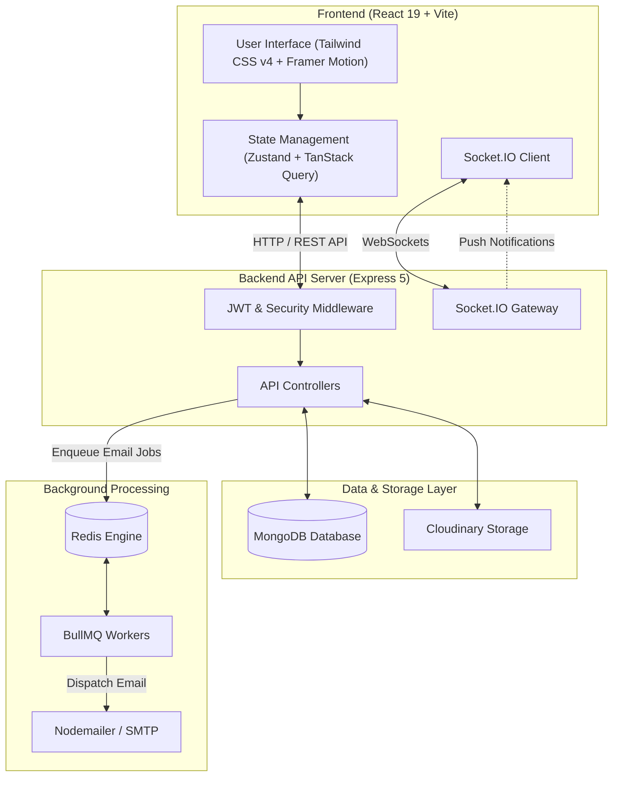

# 🚀 Obliq — Modern Workspace & Project Management Platform

<p align="center">
  
  
  
  
  
  
  
  
</p>

---

## 📌 Overview

**Obliq** is a full-stack, enterprise-grade Workspace and Project Management platform designed for seamless team collaboration, asynchronous workflows, and real-time project tracking. 

Built on a modern micro-architecture with **React 19**, **Node.js (Express 5)**, **MongoDB**, **Redis**, and **Socket.IO**, Obliq delivers a responsive user interface paired with background worker queues for reliable notifications and real-time state synchronization.

---

## ✨ Key Features

### 🏢 Workspace Management
- **Multi-Tenant Architecture**: Create and manage multiple workspaces with custom branding and team configurations.
- **Role-Based Access Control (RBAC)**: Fine-grained permissions for Owners, Admins, and Members.
- **Invitation System**: Invite members via secure email tokens with automated acceptance workflows.

### 📁 Project & Task Management
- **Kanban & List Views**: Drag-and-drop task boards with custom status pipelines (To-Do, In Progress, Review, Completed).
- **Task Granularity**: Assign tasks to team members, set priorities, set due dates, add rich descriptions, and tag tasks.
- **Attachments & Media**: Integrated Cloudinary media hosting for attachments and asset management.

### 💬 Collaboration & Real-Time Sync
- **Threaded Task Discussions**: Nested task comments for structured team discussions.
- **Live Activity Feed**: Real-time task updates and status change feeds powered by **Socket.IO**.
- **Instant Notifications**: In-app notifications and background email alerts for assignments and updates.

### ⚡ Async Processing & Performance
- **Background Worker Queues**: Decoupled email delivery powered by **BullMQ** and **Redis**.
- **Optimistic UI Updates**: Powered by **TanStack Query (v5)** and **Zustand** for zero-latency UI responses.
- **Command Palette (`cmdk`)**: Quick actions and search menu for keyboard-driven navigation.

### 🔐 Security & Authentication
- **Dual-Token JWT Auth**: Secure HTTP-only cookies with Access & Refresh Token rotation.
- **OAuth 2.0 Integration**: One-click sign-in with Google OAuth.
- **Input Validation**: Strict request validation using **Zod**.

---

## 🏗 System Architecture



---

## 🛠 Tech Stack

### Frontend
- **Framework**: [React 19](https://react.dev/) + [Vite 8](https://vitejs.dev/)
- **Styling**: [Tailwind CSS v4](https://tailwindcss.com/)
- **State Management**: [Zustand](https://github.com/pmndrs/zustand)
- **Data Fetching**: [TanStack Query v5 (React Query)](https://tanstack.com/query/latest)
- **Animations**: [Framer Motion](https://www.framer.com/motion/)
- **Icons**: [Lucide React](https://lucide.dev/)
- **Charts & Analytics**: [Recharts](https://recharts.org/)
- **Real-Time Engine**: [Socket.IO Client](https://socket.io/)

### Backend
- **Runtime**: [Node.js](https://nodejs.org/) (v20+)
- **Framework**: [Express 5](https://expressjs.com/)
- **Database**: [MongoDB](https://www.mongodb.com/) via [Mongoose 9](https://mongoosejs.com/)
- **Caching & Job Queue**: [Redis](https://redis.io/) + [BullMQ](https://docs.bullmq.io/)
- **Real-Time Engine**: [Socket.IO](https://socket.io/)
- **Authentication**: JWT (`jsonwebtoken`) + `bcryptjs`
- **Validation**: [Zod](https://zod.dev/)
- **File Storage**: [Cloudinary](https://cloudinary.com/)
- **Mailing**: [Nodemailer](https://nodemailer.com/)

---

## 📂 Project Structure

```
Obliq/
├── backend/
│   ├── src/
│   │   ├── config/          # Database, Redis, Socket.IO & Mailer configuration
│   │   ├── controllers/     # Route logic for Auth, Workspace, Project, Task, Comment
│   │   ├── middlewares/     # JWT Auth, error handling, file upload middlewares
│   │   ├── models/          # Mongoose schemas (User, Workspace, Project, Task, etc.)
│   │   ├── queues/          # BullMQ queue definitions and worker processes
│   │   ├── routes/          # Express route declarations
│   │   ├── services/        # Business logic and external service integrations
│   │   ├── templates/       # Email HTML templates
│   │   ├── validations/     # Zod request validation schemas
│   │   ├── app.js           # Express app setup and middleware configuration
│   │   └── server.js        # HTTP & Socket.IO server initialization
│   ├── seeduser.js          # Database seeding script for test users
│   ├── Dockerfile           # Backend containerization configuration
│   └── package.json
│
├── frontend/
│   ├── src/
│   │   ├── assets/          # Static assets & logos
│   │   ├── components/      # UI components, cards, modals, navigation
│   │   ├── constants/       # App constants & configuration
│   │   ├── context/         # React Context providers
│   │   ├── lib/             # Utility functions & Axios instances
│   │   ├── pages/           # Dashboard, Projects, Tasks, Auth pages
│   │   ├── services/        # API service clients
│   │   └── store/           # Zustand state stores
│   ├── package.json
│   └── vite.config.js
└── README.md
```

---

## 🚀 Getting Started

### Prerequisites

Ensure you have the following installed on your machine:
- **Node.js** (v20.x or higher)
- **MongoDB** (Local instance or MongoDB Atlas)
- **Redis** (Local instance or Redis Cloud)
- **npm** or **yarn**

---

### 📥 Installation & Setup

#### 1. Clone the Repository
```bash
git clone https://github.com/your-username/Obliq.git
cd Obliq
```

#### 2. Backend Setup
```bash
cd backend
npm install
```

Create a `.env` file in the `backend` directory (refer to `.env.example`):
```env
PORT=5000
NODE_ENV=development
FRONTEND_URL=http://localhost:3000

MONGO_URI=mongodb://127.0.0.1:27017/obliq
REDIS_URL=redis://127.0.0.1:6379

JWT_ACCESS_SECRET=your_jwt_access_secret
JWT_REFRESH_SECRET=your_jwt_refresh_secret
JWT_RESET_SECRET=your_jwt_reset_secret

GOOGLE_CLIENT_ID=your_google_client_id

# Email Config
NAME=Obliq
EMAIL=your_email@gmail.com
PASS=your_app_password

# Cloudinary Config
CLOUDINARY_CLOUD_NAME=your_cloud_name
CLOUDINARY_API_KEY=your_api_key
CLOUDINARY_API_SECRET=your_api_secret
```

#### 3. Frontend Setup
```bash
cd ../frontend
npm install
```

Create a `.env` file in the `frontend` directory (refer to `.env.example`):
```env
VITE_API_URL=http://localhost:5000
VITE_GOOGLE_CLIENT_ID=your_google_client_id
```

---

### 🏃 Running the Application

#### Seed Test Users (Optional)
Run the seed script in the backend directory to populate test user data:
```bash
cd backend
node seeduser.js
```

#### Start Backend Server
```bash
cd backend
npm run dev
```
> The API server will run at `http://localhost:5000`.

#### Start Frontend Dev Server
```bash
cd frontend
npm run dev
```
> The frontend application will run at `http://localhost:3000` (or `http://localhost:5173`).

---

## 📡 API Endpoints Overview

| Module | Endpoint | Method | Description |
| :--- | :--- | :--- | :--- |
| **Auth** | `/api/auth/register` | `POST` | Register a new user account |
| **Auth** | `/api/auth/login` | `POST` | Authenticate user & receive cookies/token |
| **Auth** | `/api/auth/google` | `POST` | Google OAuth authentication |
| **Auth** | `/api/auth/refresh` | `POST` | Refresh access token |
| **Workspace** | `/api/workspaces` | `GET / POST` | List workspaces / Create workspace |
| **Workspace** | `/api/workspaces/:id/invite` | `POST` | Send workspace invitation via email |
| **Projects** | `/api/projects` | `GET / POST` | Fetch projects / Create project |
| **Tasks** | `/api/tasks` | `GET / POST` | Fetch project tasks / Create new task |
| **Tasks** | `/api/tasks/:id` | `PATCH / DELETE` | Update task status, priority, or delete task |
| **Comments** | `/api/comments` | `GET / POST` | Retrieve task comments / Post comment |
| **Notifications**| `/api/notifications` | `GET / PATCH` | Fetch user notifications / Mark as read |

---

## 🐋 Docker Support

You can build and run the backend using Docker:

```bash
cd backend
docker build -t obliq-backend .
docker run -p 5000:5000 --env-file .env obliq-backend
```

---

## 📄 License

This project is licensed under the [ISC License](LICENSE).
